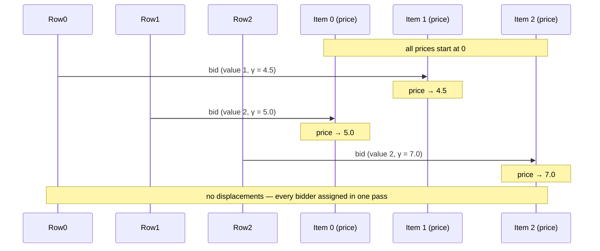

# Auction

**Bertsekas' auction algorithm** (1988) — an economic, bidding-based solver, with ε-scaling for exactness.

!!! info "Prerequisites"
    [ε-optimality](concepts.md#eps-optimality) in Key Concepts.

## Why this approach

Every other algorithm in fastlap thinks about the assignment problem in terms of graphs (augmenting paths) or linear programming (simplex pivots, dual ascent). The auction algorithm reframes it as an actual **economic auction**: rows are bidders, columns are items with prices, and bidders compete for items by raising prices until the market clears at an equilibrium that happens to be the optimal assignment. It's naturally parallelizable (each bidder's decision is local) and has a clean, intuitive termination condition.

## How it works

Each bidder (row) looks at every item (column) and computes its **value** — `cost[i][j] + price[j]` for minimization. It bids on its best item, raising that item's price enough to make its own bid strictly better than the next-best alternative (`gamma = second_best_value - best_value + epsilon`), and displaces whoever currently holds that item, if anyone.

A single fixed ε is dangerous: for integer- or tie-heavy cost matrices, breaking a tie needs the price to move by roughly 1, and with a naive `ε ≈ 1e-9` that's up to ~10⁹ bids per tie — the loop can exhaust its iteration budget with rows still unassigned. fastlap instead runs the auction at a **coarse ε first**, then repeatedly halves it, warm-starting prices between phases: the coarse phase resolves ties cheaply (in a handful of bids), and every finer phase only has to polish prices that are already near-optimal. The result is **ε-optimal**: total cost is at most `n · ε_final` above the true optimum, and `ε_final` is chosen small enough (`cost_scale × 1e-8`) to be negligible for real-valued costs.

## Pseudocode

```text
function AUCTION(cost, n):
    prices = 0
    epsilon = (max_cost - min_cost) * 0.5      # coarse start
    target  = cost_scale * 1e-8

    while epsilon >= target:
        unassigned = all rows
        while unassigned is not empty:
            bidder = unassigned.pop_front()
            best, second_best = the two cheapest (cost[bidder][j] + price[j]) values
            gamma = second_best - best + epsilon
            price[best_item] += gamma
            if best_item was held by another row: that row becomes unassigned
            assign bidder -> best_item
        epsilon /= 2

    return assignment
```

## Complexity

| | Cost |
|---|---|
| **Time** | O(n²·k), where `k` is the number of bidding rounds needed across all ε phases — each bid costs O(n) (scanning every item's value) and, empirically, far fewer than `n` bids per phase are needed once prices are warm-started |
| **Space** | O(n²) — the cost matrix dominates; `prices` and the assignment arrays are O(n) |

## Worked example

Same matrix as [LAPJV](lapjv.md#worked-example):

$$
C = \begin{pmatrix} 4 & 1 & 3 \\ 2 & 0 & 5 \\ 3 & 2 & 2 \end{pmatrix}
$$

`max_cost = 5`, `min_cost = 0`, so the first (coarsest) phase runs at `epsilon = 2.5`, all prices starting at 0:

- **Row 0 bids:** values `[4, 1, 3]` → best is item 1 (value 1), second-best is item 2 (value 3). `gamma = 3 − 1 + 2.5 = 4.5`. Price of item 1 becomes 4.5. Row 0 → item 1.
- **Row 1 bids:** values `[2+0, 0+4.5, 5+0] = [2, 4.5, 5]` → best is item 0 (value 2), second-best is item 1 (value 4.5). `gamma = 4.5 − 2 + 2.5 = 5`. Price of item 0 becomes 5. Row 1 → item 0.
- **Row 2 bids:** values `[3+5, 2+4.5, 2+0] = [8, 6.5, 2]` → best is item 2 (value 2), second-best is item 1 (value 6.5). `gamma = 6.5 − 2 + 2.5 = 7`. Price of item 2 becomes 7. Row 2 → item 2.

Every row bid exactly once, with no displacements — the phase converges immediately at: **row 0→1, row 1→0, row 2→2**, cost `1 + 2 + 2 = 5`, the true optimum. Subsequent phases (`epsilon = 1.25, 0.625, ...`) rerun the auction with these prices as a warm start; since there are no ties in this example, they reproduce the same assignment with ever more refined prices until `epsilon` drops below the convergence target.



```python
import fastlap

cost = [[4, 1, 3], [2, 0, 5], [3, 2, 2]]
total, rows, cols = fastlap.solve_lap(cost, algorithm="auction")
print(total, rows)  # 5.0 [1, 0, 2]
```

## Common pitfalls

!!! danger "A single fixed ε can make this algorithm effectively never terminate"
    This is the auction algorithm's best-known gotcha, and it's why fastlap doesn't run with one fixed `ε` at all. Breaking a tie between two equally-good items needs the losing item's price to rise past the winning one — a shift of roughly `ε`. If your costs are integers (or close to it) and you set `ε ≈ 1e-9` directly, resolving one ordinary tie can take on the order of **10⁹ individual bids**. This isn't a rare edge case in tracking or scheduling data, where tied or near-tied costs are common. The fix is exactly fastlap's ε-scaling schedule: resolve ties cheaply at a coarse `ε` first, then refine.

The auction algorithm is naturally *parallelizable* across bidders (each bidder's decision only reads global prices), but fastlap's implementation processes bids for one matrix sequentially — the parallelism fastlap does offer is across independent *matrices* via [`solve_lap_batch`](../features/batch.md), not within a single auction run.

## When to use it

`"auction"` is a good fit for large square cost matrices, especially ones without exact zero-cost ties, where its economically-motivated bidding tends to converge quickly. It's ε-optimal rather than exactly optimal in principle, but fastlap's ε-scaling drives the gap down to numerical noise for real-valued costs.

## References

- D. P. Bertsekas, *"The Auction Algorithm: A Distributed Relaxation Method for the Assignment Problem"*, Annals of Operations Research, 1988.
