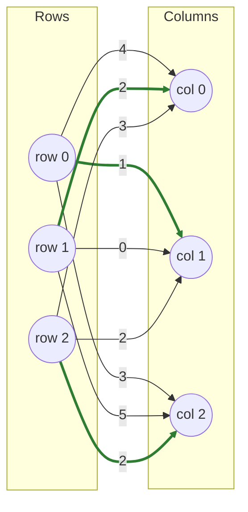
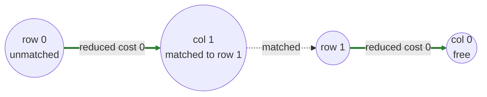

# Key Concepts

Every algorithm page on this site leans on a handful of shared ideas. Rather than re-explain them ten times, they're gathered here once — read this first if any of the per-algorithm pages feel like they're assuming background you don't have.

All examples on this page (and reused throughout the [Algorithms](index.md) section) use the same small cost matrix:

$$
C = \begin{pmatrix} 4 & 1 & 3 \\ 2 & 0 & 5 \\ 3 & 2 & 2 \end{pmatrix}
$$

whose unique optimal assignment is row 0→col 1, row 1→col 0, row 2→col 2, total cost **5**.

## The cost matrix as a bipartite graph

Every LAP is a **bipartite graph**: one set of nodes for rows, one for columns, an edge `(i, j)` for every cost `cost[i][j]`, and the goal is a **perfect matching** — a set of edges where every row and every column touches exactly one chosen edge — with minimum total edge weight.

The three green edges — row 0→col 1, row 1→col 0, row 2→col 2 — are the optimal matching. Every algorithm on this site is a different strategy for finding those green edges without checking all `n!` possible matchings by brute force.

## Dual variables and reduced cost

Almost every exact algorithm here ([LAPJV](lapjv.md), [Hungarian](hungarian.md), [Subgradient](subgradient.md), [Sinkhorn](sinkhorn.md), [SSP](ssp.md), [Cost Scaling](cost-scaling.md), [Dantzig](dantzig.md), [LAPMOD](lapmod.md)) maintains a pair of **dual variables** — `u[i]` per row, `v[j]` per column — and works with the **reduced cost** of an edge instead of its raw cost:

$$
\text{reduced}(i, j) = \text{cost}[i][j] - u[i] - v[j]
$$

The duals are kept **feasible** — `u[i] + v[j] ≤ cost[i][j]` for every `(i, j)`, i.e. every reduced cost stays non-negative — throughout the algorithm. Feasible duals are useful because they give a cheap, verifiable **lower bound** on the true optimum (`Σu[i] + Σv[j] ≤` any feasible matching's cost), and the moment a matching's total cost *equals* that bound, the matching is provably optimal — no need to check every alternative.

Different algorithms build `(u, v)` differently: [LAPJV](lapjv.md) derives them from column minima, [Subgradient](subgradient.md) builds them via coordinate ascent, [Sinkhorn](sinkhorn.md) derives them from entropic matrix scaling, [SSP](ssp.md) and [Cost Scaling](cost-scaling.md) update them per flow-augmentation step — but they're all computing (an approximation to) the same underlying object.

## Complementary slackness

An assignment and a dual pair `(u, v)` are simultaneously optimal exactly when every *used* edge is **tight** — its reduced cost is exactly 0:

$$
\text{if } \pi(i) = j \text{ in the matching, then } u[i] + v[j] = \text{cost}[i][j]
$$

This is the certificate several algorithms check directly: [LAPJV](lapjv.md#how-it-works)'s phase-1 column reduction produces a partial matching that's tight by construction; [Hungarian](hungarian.md#how-it-works) covers exactly the zeros (tight cells) of its reduced matrix; [Dantzig](dantzig.md#how-it-works) stops pivoting the moment no non-basic cell has negative reduced cost, because that's precisely this condition holding everywhere.

## Augmenting paths

A **shortest augmenting path (SAP)** is the graph-search idea underneath [LAPJV](lapjv.md), [Hungarian](hungarian.md) (via star/prime marks instead, but the same underlying idea), [Subgradient](subgradient.md), [Sinkhorn](sinkhorn.md), and [LAPMOD](lapmod.md). Starting from an unmatched row, it searches for a path that alternates between unmatched and matched edges, ending at an unmatched column:

*"Free"* means the path found an unmatched column and can stop. **Flipping** the path — swapping which edges count as "matched" along it — extends the matching by exactly one more row, without disturbing any row outside the path. Run this once per unmatched row and the matching is complete; because the search always looks for the cheapest (reduced-cost) extension, the final matching is exactly optimal, not just any perfect matching. See the [LAPJV worked example](lapjv.md#worked-example) for this exact path traced through with numbers.

## Approximation ratio

[Greedy](greedy.md) is the one algorithm on this site that doesn't guarantee optimality — it guarantees a **1/2-approximation**: its total cost is never more than 2× the true optimum. This comes from a simple exchange argument (any matching can be decomposed into alternating paths/cycles against the greedy solution, each contributing at least half its weight), not from any dual or augmenting-path machinery.

## ε-optimality { #eps-optimality }

[Auction](auction.md) and, during its intermediate phases, [Cost Scaling](cost-scaling.md) don't insist on exact optimality at every step — they allow a bounded slack `ε` (a solution is **ε-optimal** if its cost is within `n · ε` of the true optimum), then shrink `ε` geometrically across phases until it's smaller than machine-precision noise. This trades a small, controllable amount of exactness for solutions that are much cheaper to compute at each individual step — coarse phases resolve the "obvious" parts of the matching cheaply, and only the final, smallest-ε phase has to be precise.

## Min-cost flow framing

[SSP](ssp.md) and [Cost Scaling](cost-scaling.md) treat the assignment problem as an instance of **min-cost flow**: a source connects to every row, every column connects to a sink, row→column edges cost what the matrix says, and one unit of flow has to travel from source to sink through each row. A perfect matching is exactly a flow that saturates every row and column edge at minimum total cost. This framing is what lets those two algorithms borrow directly from the broader network-flow algorithm literature (Dijkstra with potentials, push-relabel) instead of assignment-specific machinery.

## Where to go next

Head to the [Algorithms overview](index.md) and work through the pages in order — [Greedy](greedy.md) needs none of the above, and each subsequent page introduces roughly one new idea from this glossary at a time.
