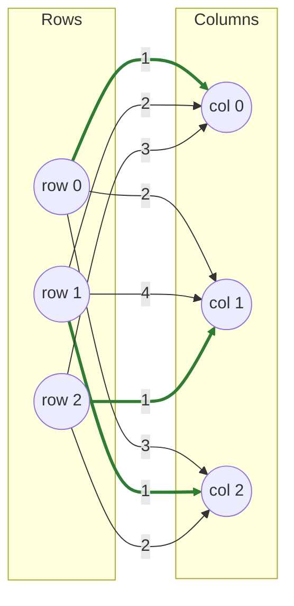

# Cost Scaling

**Goldberg–Kennedy push-relabel** with cost scaling (ε-relaxation).

!!! info "Prerequisites"
    [ε-optimality](concepts.md#eps-optimality) and [Min-Cost Flow Framing](concepts.md#min-cost-flow-framing) in Key Concepts. Reading [SSP](ssp.md) first helps — both treat assignment as flow, just with different search strategies.

## Why this approach

Push-relabel algorithms are the fastest known family of max-flow solvers in practice, built on *local* operations (a node pushes excess flow to a neighbor, or relabels its own potential) rather than global path-search. Goldberg & Kennedy adapted this idea to min-cost flow — and by extension, assignment — via **cost scaling**: solve a sequence of relaxed problems, each only required to be optimal "up to ε," with ε shrinking geometrically each phase. Because a solution that's ε-optimal for a small enough ε (specifically `ε < 1/(n+1)` on integer-ish costs) is provably exactly optimal, the last phase recovers the true answer.

## How it works

1. **Initialize.** Row potentials `u[i]` start at each row's minimum cost (making every row's cheapest cell have reduced cost 0); column potentials `v[j]` start at 0. `ε` starts coarse — half the largest cost magnitude in the matrix.
2. **Each phase, first discard infeasible matches.** Any existing match `(r, c)` whose reduced cost `cost[r][c] − u[r] − v[c]` now exceeds the *current* (smaller) `ε` gets unmatched — it was only ε-optimal for a coarser tolerance.
3. **Push or relabel.** For every unmatched row, look at its cheapest column by reduced cost. If that reduced cost is `≤ 0`, push into it — matching the row (and bumping any previous occupant back onto the unmatched queue). Otherwise, **relabel**: raise the row's potential `u[i]` just enough that its best column's reduced cost becomes `≤ 0`, then retry.
4. **Scale down.** Once every row is matched at the current `ε`, divide `ε` by 4 (`α = 4`) and repeat from step 2, until `ε` drops below the target tolerance `~1/(n+1)`.
5. **Polish.** A final warm-started shortest-augmenting-path pass (the same mechanism [LAPJV](lapjv.md#how-it-works) uses) cleans up any residual slack from the ε-relaxation and guarantees an exactly optimal, not just ε-optimal, result.

## Pseudocode

```text
function COST_SCALING(cost, n):
    u[i] = min_j cost[i][j]           for each row     # initial potentials
    v[j] = 0
    epsilon = max(max_abs_cost * 0.5, 1.0)
    target  = min(1 / (n + 1), 1e-4)

    while epsilon >= target:
        unmatch any (r, c) where cost[r][c] - u[r] - v[c] > epsilon

        active = all currently-unmatched rows
        while active is not empty:
            r = active.pop_front()
            c, reduced = the column with the smallest reduced cost for row r
            if reduced <= 0:
                if c was matched to some r': active.push(r')
                match r -> c
            else:
                u[r] += reduced + epsilon        # relabel
                active.push(r)

        epsilon /= 4

    return SAP(cost, warm_start = (u, v))     # polish to exact optimality
```

## Complexity

| | Cost |
|---|---|
| **Time** | O(n³ log(nC)) — the `log(nC)` factor counts the roughly `log₄(cost_range / target_ε)` scaling phases (capped at 30 in fastlap), each phase bounded by O(n³) push/relabel work in the worst case; the final SAP polish adds another O(n³) worst-case term of the same order |
| **Space** | O(n²) — the padded cost matrix; potentials, match arrays, and the active-row queue are O(n) |

## Worked example

Same matrix as [Sinkhorn](sinkhorn.md#worked-example), which fastlap's own test suite (`src/lap/cost_scaling.rs`) also verifies:

$$
C = \begin{pmatrix} 1 & 2 & 3 \\ 2 & 4 & 1 \\ 3 & 1 & 2 \end{pmatrix}
$$

**Initial potentials:** `u = [1, 1, 1]` (row minima), `v = [0, 0, 0]`. `max_cost = 4`, so the first phase runs at `epsilon = 2.0`.

**First (and only) phase**, processing rows in order with nothing yet matched:

- **Row 0:** reduced costs `[1−1−0, 2−1−0, 3−1−0] = [0, 1, 2]`. Cheapest is column 0 at reduced cost 0 — push. Row 0 → column 0.
- **Row 1:** reduced costs `[2−1−0, 4−1−0, 1−1−0] = [1, 3, 0]`. Cheapest is column 2 at reduced cost 0 — push. Row 1 → column 2.
- **Row 2:** reduced costs `[3−1−0, 1−1−0, 2−1−0] = [2, 0, 1]`. Cheapest is column 1 at reduced cost 0 — push. Row 2 → column 1.

Every row found a reduced cost of exactly 0 immediately — no relabels, no displacements — so the very first (coarsest) phase already produces: **row 0→0, row 1→2, row 2→1**, cost `1 + 1 + 1 = 3`, which is already the true optimum. The remaining ε-scaling phases (and the final SAP polish) confirm it without changing anything.



```python
import fastlap

cost = [[1, 2, 3], [2, 4, 1], [3, 1, 2]]
total, rows, cols = fastlap.solve_lap(cost, algorithm="cost_scaling")
print(total, rows)  # 3.0 [0, 2, 1]
```

## Common pitfalls

!!! danger "ε-optimal is not optimal — until the last phase"
    It's easy to assume push-relabel's output is exact the moment every row is matched at some `ε`, since the matching *looks* complete. It isn't, in general: a match that satisfied complementary slackness up to a coarse `ε` can still be off from the true optimum by as much as `n · ε`. That's precisely why fastlap keeps scaling `ε` down by a factor of 4 each phase (discarding and re-matching any edge that's no longer within the *new*, tighter tolerance) rather than stopping at the first phase where every row happens to be matched — and why the final SAP polish exists at all: it's the step that actually converts "ε-optimal at a tiny ε" into "exactly optimal."

The relabel step (`u[r] += reduced + epsilon`) has to raise the potential by *at least* `epsilon` past the best reduced cost, not just enough to reach 0 — under-shooting here can cause the same row to relabel repeatedly without making progress, since a reduced cost of exactly 0 doesn't satisfy the phase's `≤ 0` push condition robustly under floating point.

## When to use it

`"cost_scaling"` is the right pick if you're studying push-relabel/network-flow methods specifically, or working alongside other cost-scaling-based flow tooling. For general-purpose exact solving, [LAPJV](lapjv.md) reaches the same guarantee without the multi-phase ε schedule.

## References

- A. V. Goldberg & R. Kennedy, *"An Efficient Cost Scaling Algorithm for the Assignment Problem"*, Mathematical Programming, 1995.
