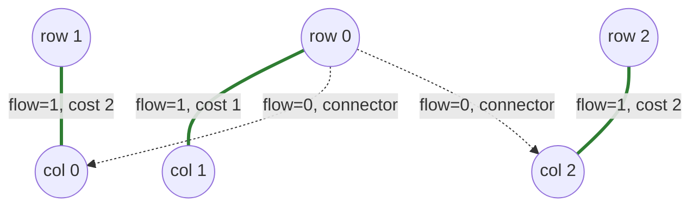

# Dantzig

**Primal network simplex** (the classical "transportation simplex" / MODI method), applied directly to the assignment LP's spanning-tree basis.

!!! info "Prerequisites"
    [Complementary Slackness](concepts.md#complementary-slackness) in Key Concepts — a Dantzig pivot is exactly the act of restoring it one non-tight cell at a time. Some prior exposure to LP simplex (basic feasible solutions, entering/leaving variables) helps but isn't required — the assignment-specific version is explained below from scratch.

## Why this approach

The assignment problem is a linear program, and Dantzig's simplex method is *the* classical way to solve linear programs — pivoting from one basic feasible solution to a better one until no improving pivot exists. Every other algorithm in fastlap works with dual variables or augmenting paths; Dantzig's is the one genuinely primal-simplex implementation, useful if you're studying the LP structure of the assignment problem directly rather than treating it as a graph-matching problem.

## How it works

The assignment LP's constraint matrix is totally unimodular with unit supplies/demands, so every basic solution is integral — each basic cell's flow is exactly 0 or 1, and at optimality the flow-1 cells are exactly the assignment. A basic feasible solution here is a **spanning tree** over `2n` nodes (`n` rows + `n` columns, `2n − 1` tree edges/basic cells — `n` of them the real assignment, the rest degenerate zero-flow "connector" edges needed just to keep the tree spanning).

1. **Build an initial spanning tree.** Rather than the textbook Northwest-Corner rule (which ignores cost and typically starts many pivots from optimal), fastlap greedily assigns each row to its cheapest still-available column — `n` edges, forming `n` disconnected 2-node components — then adds exactly `n − 1` more zero-flow connector edges (via union-find) to merge them into one tree.
2. **Compute potentials.** A single BFS from the tree's root solves `u[i] + v[j] = cost[i][j]` for every basic cell.
3. **Pick the entering variable.** Scan every non-basic cell for the **most negative reduced cost** `cost[i][j] − u[i] − v[j]` — this is Dantzig's original pivoting rule (as opposed to, say, Bland's rule, which just takes the first improving cell).
4. **Pivot.** The entering edge creates exactly one cycle in the tree. Walk it, alternating `+`/`−` signs starting from the entering cell; the largest flow shift `θ` that keeps every `−` cell non-negative is applied, and the `−` cell with flow exactly `θ` leaves the basis.
5. **Repeat** from step 2 until no entering cell has a negative reduced cost.

Because the assignment LP is maximally degenerate (`n` real edges out of `2n − 1` basic cells, the rest carrying zero flow), Dantzig's rule alone can cycle forever on some inputs. fastlap falls back to Bland's rule (first improving cell, not most-negative) after a run of degenerate pivots, which guarantees termination without giving up Dantzig pivoting for the common case.

## Pseudocode

```text
function DANTZIG(cost, n):
    # Build initial spanning tree
    for each row r: assign r to its cheapest unclaimed column         # n edges
    connect the n resulting components into one tree with n-1
        zero-flow edges (union-find)

    loop:
        u, v = potentials solved by BFS from the tree root

        entering = non-basic cell with the most negative reduced cost
                   (cost[i][j] - u[i] - v[j]);
                   after many degenerate pivots in a row, use the first
                   improving cell instead (Bland's rule) to guarantee termination
        if no entering cell exists: return the flow=1 cells as the assignment

        find the unique cycle `entering` creates in the tree
        theta = smallest flow among the cycle's "-" cells
        shift flow by theta around the cycle
        entering cell joins the basis; the "-" cell at theta leaves it
```

## Complexity

| | Cost |
|---|---|
| **Time** | O(n³) typical. Each pivot costs O(n²) (potentials via O(n) tree BFS, entering-variable search via a full O(n²) scan of non-basic cells); the pivot count is bounded empirically by fastlap's `50n² + 1000` iteration cap, giving an O(n⁴) worst-case bound, though in practice — especially with the greedy initial tree — far fewer pivots are needed |
| **Space** | O(n²) — dense `flow` and `is_basic` matrices; tree adjacency lists total O(n) edges |

## Worked example

Same matrix as the [LAPJV](lapjv.md#worked-example) and [Hungarian](hungarian.md#worked-example) pages:

$$
C = \begin{pmatrix} 4 & 1 & 3 \\ 2 & 0 & 5 \\ 3 & 2 & 2 \end{pmatrix}
$$

**Initial greedy tree:** row 0's cheapest column is column 1 (cost 1) → claim it. Row 1's cheapest column among those still available (column 1 is now taken) is column 0 (cost 2) → claim it. Row 2's only remaining column is column 2 (cost 2) → claim it. The initial greedy assignment is already **row 0→1, row 1→0, row 2→2** — the true optimum — before any pivoting starts. Two degenerate zero-flow connector edges are added to complete the spanning tree (row 0–col 0 and row 0–col 2).



Solid edges are the real (flow=1) assignment; dashed edges are the two degenerate zero-flow connectors needed to keep all `2n − 1 = 5` basic cells forming one spanning tree.

**Potentials from this tree:** `u = [0, −2, −1]`, `v = [4, 1, 3]` (rooted at row 0).

**Checking for an entering variable:** the reduced cost of every non-basic cell — `(1,1)`, `(1,2)`, `(2,0)`, `(2,1)` — comes out to `1, 4, 0, 2` respectively. None is negative (`(2,0)` is a zero-reduced-cost tie, not an improvement), so the algorithm terminates immediately: **zero pivots needed**. This is a direct illustration of the source's own reasoning for using a greedy initial tree instead of Northwest-Corner — on many inputs, it already lands on (or very near) the optimum.

```python
import fastlap

cost = [[4, 1, 3], [2, 0, 5], [3, 2, 2]]
total, rows, cols = fastlap.solve_lap(cost, algorithm="dantzig")
print(total, rows)  # 5.0 [1, 0, 2]
```

!!! note "When a pivot *is* needed"
    If the greedy initial tree isn't already optimal, step 3 finds a non-basic cell with negative reduced cost, step 4 finds the cycle that cell's entering edge creates in the tree, and flow shifts around that cycle by the smallest "leaving" flow — exactly the stepping-stone pivot described above. This example happens to need none, but the same mechanism handles the general case.

## Common pitfalls

!!! danger "Dantzig's rule alone can cycle forever on this specific LP"
    The assignment LP is about as degenerate as a linear program gets: only `n` of the `2n − 1` basic cells ever carry real (non-zero) flow, the rest are connector edges pinned at exactly 0. That degeneracy is precisely the condition under which the classical "most-negative-reduced-cost" pivoting rule is known to cycle indefinitely — the entering variable keeps changing, but the objective never actually improves, because every pivot has `theta = 0`. This is not a hypothetical concern for the assignment problem specifically; it's why fastlap tracks a `degenerate_streak` counter and falls back to Bland's rule (least-index entering variable) once that streak gets long enough. If you strip that fallback out because it looks like unnecessary complexity, the solver can hang forever on real adversarial input.

The initial spanning tree matters far more than it might seem: a Northwest-Corner start (ignoring cost entirely) versus fastlap's greedy start can be the difference between zero pivots (as in this worked example) and a large number of them — the same lesson every LP practitioner learns eventually: **a good starting basic feasible solution is often worth more than a clever pivoting rule.**

## When to use it

Reach for `"dantzig"` if you're working in an LP/simplex-adjacent context and want an assignment solver that's genuinely built on primal simplex machinery rather than dual/augmenting-path reasoning. For general use, [LAPJV](lapjv.md) is faster and has a tighter worst-case bound.

## References

- G. B. Dantzig, *"Linear Programming and Extensions"*, Princeton University Press, 1963 (Chapter 21 covers the transportation/assignment simplex).
