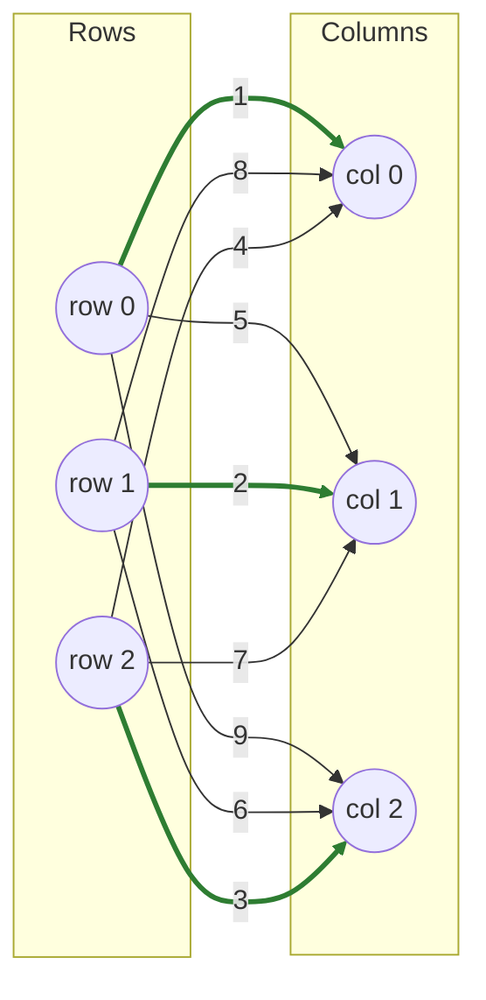

# Greedy

A **1/2-approximation** baseline: sort every edge by cost and greedily claim the cheapest still-available pair.

!!! info "Prerequisites"
    None — this is the one algorithm on this site that needs no background theory. See [Approximation Ratio](concepts.md#approximation-ratio) in Key Concepts for where the 1/2 bound comes from.

## Why this approach

Every other algorithm in fastlap is exact (or, for [Auction](auction.md), ε-optimal to a negligible tolerance) — which always costs at least O(n²) preprocessing and typically O(n³) in the worst case. Sometimes that's more than you need: if you're gating candidates upstream (e.g. only keeping edges under a distance threshold) or working under a tight latency budget, a fast approximate matching can be good enough, or serve as a cheap sanity baseline to compare an exact solver against.

## How it works

1. Collect every finite `(row, col, cost)` triple in the matrix.
2. Sort them by cost, ascending.
3. Walk the sorted list once: claim a pair if both its row and its column are still unclaimed; skip it otherwise.

There's no backtracking and no reconsideration — once a row or column is claimed, it's claimed for good, even if a later (more expensive) pairing would have unlocked a much cheaper solution elsewhere. This greedy, no-lookahead structure is exactly what bounds it to a **1/2-approximation**: the total cost is never more than twice the true optimum.

## Pseudocode

```text
function GREEDY(cost, n, m):
    edges = [(i, j, cost[i][j]) for every finite cell]
    sort edges by cost, ascending

    row_used, col_used = false, false
    for (i, j, c) in edges:
        if not row_used[i] and not col_used[j]:
            assign i -> j
            row_used[i] = col_used[j] = true

    return assignment, sum of assigned costs
```

## Complexity

| | Cost |
|---|---|
| **Time** | O(n² log n) — building the edge list is O(n²), sorting it dominates at O(n² log n²) = O(n² log n), and the single greedy pass is O(n²) |
| **Space** | O(n²) — the edge list holds every finite cell; `row_used`/`col_used` are O(n) |

## Worked example

fastlap's own test suite (`src/lap/greedy.rs`) verifies this exact case:

$$
C = \begin{pmatrix} 1 & 5 & 9 \\ 8 & 2 & 6 \\ 4 & 7 & 3 \end{pmatrix}
$$



**Sorted edges:** `(0,0,1), (1,1,2), (2,2,3), (2,0,4), (0,1,5), (1,2,6), (2,1,7), (1,0,8), (0,2,9)`.

**Greedy pass:**

- `(0,0,1)` — both free → claim. Row 0 → col 0.
- `(1,1,2)` — both free → claim. Row 1 → col 1.
- `(2,2,3)` — both free → claim. Row 2 → col 2.
- Every remaining edge involves an already-claimed row or column — all skipped.

Result: **row 0→0, row 1→1, row 2→2**, cost `1 + 2 + 3 = 6`. In this particular example, the greedy result happens to coincide with the true optimum — the three cheapest cells in the whole matrix happen to form a valid matching — but that's not guaranteed in general; greedy only guarantees staying within 2× of optimal.

```python
import fastlap

cost = [[1, 5, 9], [8, 2, 6], [4, 7, 3]]
total, rows, cols = fastlap.solve_lap(cost, algorithm="greedy")
print(total, rows)  # 6.0 [0, 1, 2]
```

## Common pitfalls

!!! danger "Greedy can be arbitrarily bad on adversarial input"
    The 1/2-approximation bound is tight — it's not a pessimistic worst case that never actually happens. Consider:

    $$
    C = \begin{pmatrix} 1 & 2 \\ 1.5 & 100 \end{pmatrix}
    $$

    Sorted edges: `(0,0,1), (1,0,1.5), (0,1,2), (1,1,100)`. Greedy claims `(0,0)` first (cost 1), which blocks `(1,0)` — the *actually* cheap way to route row 1. Row 1 is left with only column 1, at cost 100. Greedy's total: `1 + 100 = 101`. True optimum: row 0→col 1, row 1→col 0, total `2 + 1.5 = 3.5`. Greedy's no-lookahead, no-backtracking structure has no way to see that coming.

    In general: the earlier a cheap edge appears in sort order, the more it can foreclose a much better global structure. This is exactly why every other algorithm on this site pays for *some* form of lookahead (augmenting paths, dual reasoning, or simplex pivots) instead.

Ties in the sorted edge list are broken by whatever order the sort happens to leave them in (not by any preference for one solution over another) — don't rely on greedy's output being deterministic-by-value across ties in general-purpose code, even though fastlap's sort is itself deterministic for a given input.

## When to use it

Use `"greedy"` only when you explicitly want speed over optimality — a rough approximate matching under a strict time budget, or a fast baseline to compare an exact solver's runtime against. For anything where the assignment itself matters (tracking, scheduling, resource allocation), use one of the ten exact (or ε-optimal) algorithms instead — [LAPJV](lapjv.md) by default.

!!! warning "Not exact"
    Unlike every other algorithm on this page's family of siblings, greedy does not guarantee the optimal assignment — only a cost at most 2× the optimum.
