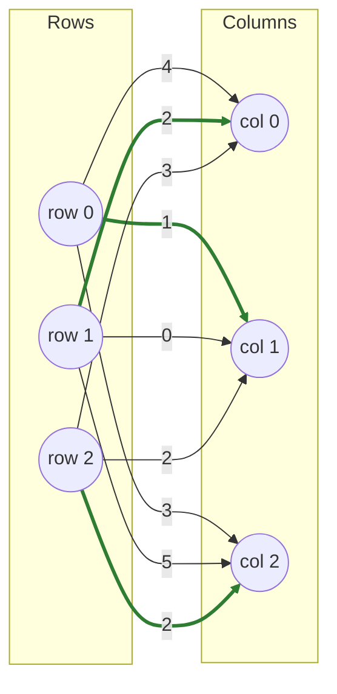

# Hungarian Algorithm

**Kuhn–Munkres algorithm** (Kuhn, 1955; Munkres, 1957) — the textbook solver most people mean when they say "the Hungarian algorithm."

!!! info "Prerequisites"
    [Complementary Slackness](concepts.md#complementary-slackness) in Key Concepts — starred zeros in this algorithm *are* the tight (zero-reduced-cost) edges that condition describes, just discovered without ever naming `u` and `v` explicitly.

## Why this approach

The Hungarian algorithm was the first polynomial-time solver for the assignment problem, and it's built on a very different mental model than the shortest-augmenting-path family fastlap otherwise leans on ([LAPJV](lapjv.md), [Subgradient](subgradient.md), [Sinkhorn](sinkhorn.md)): instead of tracking dual variables and running per-row Dijkstra-like searches, it works directly on a **reduced cost matrix**, repeatedly covering zeros with the fewest possible lines until a full zero-cost matching is exposed. fastlap keeps a genuinely separate implementation of this — different data structures (star/prime marks, row/column cover flags), different control flow — even though it always agrees with the SAP-based solvers on the answer.

## How it works

1. **Row and column reduction.** Subtract each row's minimum from that row, then each column's minimum from that column. Every entry is now ≥ 0, and at least one zero exists in every row and column.
2. **Star independent zeros.** Scan the reduced matrix; whenever a zero's row and column are both uncovered, mark it *starred* and cover its row and column. Starred zeros are a candidate (possibly partial) matching.
3. **Cover columns with a star.** If every column is covered, the starred zeros already form a complete assignment — done.
4. **Find an uncovered zero.** If none exists, go to step 6. If one exists and its row has a starred zero, uncover that zero's column and cover the row instead (this "frees up" a column to look for a better zero); otherwise, this zero starts an augmenting path — go to step 5.
5. **Augment.** Trace an alternating path of starred and *primed* zeros starting from the uncovered primed zero found in step 4, flipping every star to non-star and every prime to star along the way. Clear all cover marks and all remaining primes, then go back to step 3.
6. **Shift the matrix.** No uncovered zero exists — find the smallest uncovered value, add it to every covered row, subtract it from every uncovered column. This exposes a new zero without disturbing any already-covered structure. Go back to step 4.

## Pseudocode

```text
function HUNGARIAN(cost, n):
    reduce every row by its minimum, then every column by its minimum
    star an independent zero in each row/column where possible

    loop:
        cover every column containing a starred zero
        if all n columns covered: return starred zeros as the assignment

        while an uncovered zero exists:
            prime it
            if its row has a starred zero:
                cover that row, uncover that zero's column
            else:
                augment(the alternating star/prime path from here)
                break out to re-cover columns

        if no uncovered zero exists:
            m = smallest uncovered value
            add m to every covered row; subtract m from every uncovered column
```

## Complexity

| | Cost |
|---|---|
| **Time** | O(n³) — the classical bound. Each of the O(n) augmentation phases does O(n²) work finding zeros and updating covers, and the total work across all phases (including step 6's matrix shifts) amortizes to O(n³), not the naive O(n⁴) a per-phase-times-phases count would suggest |
| **Space** | O(n²) — the reduced cost matrix and the star/prime mask matrix; cover flags and path buffers are O(n) |

## Worked example

Same matrix as the [LAPJV example](lapjv.md#worked-example):

$$
C = \begin{pmatrix} 4 & 1 & 3 \\ 2 & 0 & 5 \\ 3 & 2 & 2 \end{pmatrix}
$$

**Row reduction** (subtract row minima 1, 0, 2): 

$$\begin{pmatrix} 3 & 0 & 2 \\ 2 & 0 & 5 \\ 1 & 0 & 0 \end{pmatrix}$$

**Column reduction** (subtract column minima 1, 0, 0):

$$\begin{pmatrix} 2 & 0 & 2 \\ 1 & 0 & 5 \\ 0 & 0 & 0 \end{pmatrix}$$

**Star zeros:** scanning row-major, (0,1) stars first (covering row 0, col 1); (1,1) is skipped (col 1 already covered); (2,0) stars (covering row 2, col 0); (2,2) is skipped (row 2 now covered). Two starred zeros — not yet a complete matching.

**Cover columns with a star:** columns 0 and 1 get covered (2 of 3) — not all covered, continue.

**Find an uncovered zero:** (2,2) is the only uncovered zero. Its row (row 2) already has a starred zero at (2,0), so cover row 2 and uncover column 0 instead — no augmenting path yet.

**Find an uncovered zero (again):** none exist now (check: (0,0)=2, (1,0)=1, all in the still-uncovered column 0 but neither is zero). Go to step 6.

**Shift the matrix:** the smallest uncovered value is 1 (at cell (1,0)). Add 1 to row 2 (the covered row); subtract 1 from columns 0 and 2 (the uncovered columns):

$$\begin{pmatrix} 1 & 0 & 1 \\ 0 & 0 & 4 \\ 0 & 1 & 0 \end{pmatrix}$$

**Find an uncovered zero:** (1,0) is uncovered and zero. Its row (row 1) has no starred zero, so this starts an augmenting path.

**Augment:** the alternating path is (1,0) → (2,0) [starred] → (2,2) [primed, found earlier]. Flipping stars/primes along it: (1,0) becomes starred, (2,0) becomes unstarred, (2,2) becomes starred. Now three starred zeros exist: (0,1), (1,0), (2,2) — covering all three columns.

**Done.** Final assignment: row 0→1, row 1→0, row 2→2, cost `1 + 2 + 2 = 5` — the same optimum LAPJV found, reached through a completely different mechanism.



```python
import fastlap

cost = [[4, 1, 3], [2, 0, 5], [3, 2, 2]]
total, rows, cols = fastlap.solve_lap(cost, algorithm="hungarian")
print(total, rows)  # 5.0 [1, 0, 2]
```

## Common pitfalls

!!! danger "Many textbook/blog implementations of \"the Hungarian algorithm\" are wrong for n ≥ 3"
    fastlap's own project history is a real example: an earlier version of this crate shipped a simplified augmenting-path implementation that produced *suboptimal* results on matrices 3×3 and larger — subtle enough to pass small hand-checked examples, wrong in general. The failure mode is almost always in step 5 (tracing the alternating star/prime path): it's easy to write code that flips the *first* zero it finds rather than following the actual alternating chain back to its root, which silently breaks the optimality guarantee on anything but the smallest cases. If you're implementing this from a blog post rather than a peer-reviewed reference, test it against `scipy.optimize.linear_sum_assignment` on random matrices before trusting it.

Floating-point costs need a small epsilon tolerance (fastlap uses `scale × 1e-9`) when checking "is this cell zero" — comparing reduced costs to exactly `0.0` will miss legitimately-tight cells due to rounding and can make the algorithm loop or misbehave.

## When to use it

Reach for `"hungarian"` when you specifically want the classical zero-covering algorithm — teaching, textbook cross-checking, or debugging against reference material that describes Kuhn-Munkres directly. For production code, [LAPJV](lapjv.md) is the faster default at the same O(n³) worst case.

## References

- H. W. Kuhn, *"The Hungarian Method for the Assignment Problem"*, Naval Research Logistics Quarterly, 1955.
- J. Munkres, *"Algorithms for the Assignment and Transportation Problems"*, Journal of the Society for Industrial and Applied Mathematics, 1957.
