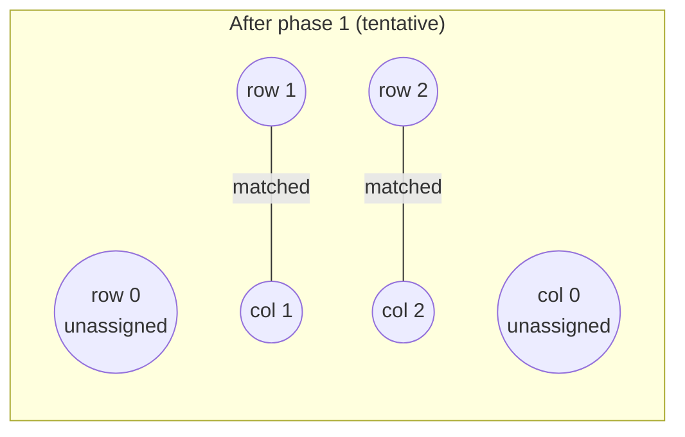
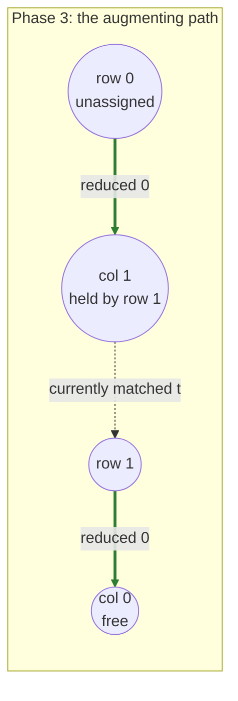
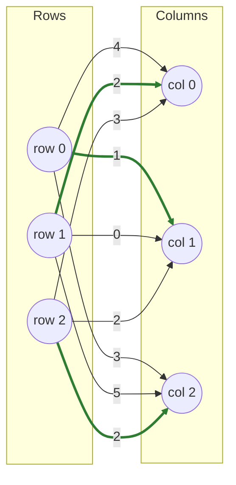

# LAPJV

**Jonker–Volgenant algorithm** (1987). fastlap's default (`algorithm="lapjv"`).

!!! info "Prerequisites"
    [Dual Variables & Reduced Cost](concepts.md#dual-variables-and-reduced-cost), [Complementary Slackness](concepts.md#complementary-slackness), and [Augmenting Paths](concepts.md#augmenting-paths) in Key Concepts — this page uses all three by name.

## Why this approach

A cold shortest-augmenting-path (SAP) solve — the kind [Hungarian](hungarian.md) and [Subgradient](subgradient.md) eventually fall back to — treats every row as unknown and pays a full O(n²) search to resolve it. But on most real cost matrices, a large fraction of rows have an *obvious* best column: the row's cheapest cell simply isn't contested by any other row. Jonker & Volgenant's insight was to resolve those "easy" rows with two cheap O(n²) preprocessing passes — **column reduction** and **reduction transfer** — before paying the expensive per-row search only for the rows that are genuinely ambiguous.

## How it works

1. **Column reduction.** For each column `j`, find its cheapest row `i*` and tentatively assign `row[i*] = j`. If a row is claimed by more than one column this way, it keeps only the claimant with the smaller reduced value; the losing column is left unassigned. This produces a feasible dual `v[j]` for every column and a partial primal matching for free.
2. **Reduction transfer.** For every row claimed by *exactly one* column, tighten that column's dual using the row's second-best reduced cost. This shrinks the search space phase 3 has to explore, without disturbing the (already-optimal) partial matching.
3. **Row duals.** Compute `u[i] = min_j(cost[i][j] - v[j])`. By construction, every row phase 1 resolved satisfies complementary slackness exactly against `(u, v)` — the partial matching is optimal under these duals already.
4. **Warm-started SAP.** Run the shortest-augmenting-path solver (the same primitive `hungarian.rs` implements differently) on only the rows phase 1 left unassigned, starting from `(u, v)` instead of the zero vector. Each augmenting path only has to *extend* an already-near-optimal dual pair, not build one from scratch.

## Pseudocode

```text
function LAPJV(cost, n):
    # Phase 1 — column reduction
    for j in 0..n:
        i* = argmin_i cost[i][j]
        v[j] = cost[i*][j]
        if row i* unclaimed, or v[j] < v[current claimant's column]:
            assign row i* -> column j (unassign its previous column, if any)

    # Phase 2 — reduction transfer
    for each row i claimed by exactly one column j1:
        min_other = min over j != j1 of (cost[i][j] - v[j])
        v[j1] -= min_other

    # Feasible row duals
    for i in 0..n:
        u[i] = min_j (cost[i][j] - v[j])

    # Phase 3 — warm-started shortest augmenting path
    for each row i left unassigned by phase 1:
        find shortest augmenting path from i using duals (u, v)
        augment along it, updating (u, v) as the path is discovered

    return assignment, sum of assigned costs
```

## Complexity

| | Cost |
|---|---|
| **Time** | O(n²) for phases 1–2, up to O(n³) worst case for phase 3 (one O(n²) augmenting-path search per still-unassigned row) — **O(n³) overall**, but often far less in practice since phases 1–2 typically resolve most rows |
| **Space** | O(n²) — the padded cost matrix dominates; all dual/assignment arrays are O(n) |

## Worked example

Consider:

$$
C = \begin{pmatrix} 4 & 1 & 3 \\ 2 & 0 & 5 \\ 3 & 2 & 2 \end{pmatrix}
$$

The unique optimum is row 0→col 1, row 1→col 0, row 2→col 2, total cost **5**.

**Phase 1 (column reduction):**

- Col 0: cheapest is row 1 (cost 2) → tentatively row 1 → col 0. `v[0] = 2`.
- Col 1: cheapest is row 1 (cost 0) → `0 < v[0]=2`, so row 1's claim moves to col 1, freeing col 0. `v[1] = 0`.
- Col 2: cheapest is row 2 (cost 2) → row 2 → col 2. `v[2] = 2`.

After phase 1: `v = [2, 0, 2]`; row 1 → col 1, row 2 → col 2; row 0 and col 0 are unassigned.



**Phase 2 (reduction transfer):** row 2 was claimed by exactly one column (col 2). Its next-best reduced cost is `min(cost[2][0] - v[0], cost[2][1] - v[1]) = min(3-2, 2-0) = 1`, so `v[2] -= 1` → `v = [2, 0, 1]`.

**Row duals:** `u[0] = min(4-2, 1-0, 3-1) = 1`, `u[1] = min(2-2, 0-0, 5-1) = 0`, `u[2] = min(3-2, 2-0, 2-1) = 1`.

**Phase 3:** only row 0 is unassigned. Its reduced costs to each column are `[4-1-2, 1-1-0, 3-1-1] = [1, 0, 1]` — column 1 is cheapest, but column 1 is already taken by row 1. The search extends from there: row 1's reduced cost to column 0 is `2-0-2 = 0`, so the path "row 0 → col 1 (displace row 1) → row 1 → col 0 (free)" has total reduced distance `0 + 0 = 0`, beating the direct route to column 2 (distance 1). Column 0 is free, so the path terminates there and gets flipped: row 1 moves to column 0, freeing column 1 for row 0.

Final assignment: **row 0→1, row 1→0, row 2→2**, cost `1 + 2 + 2 = 5` — the true optimum, with only one row ever needing the expensive search.



Flipping this path — row 1 moves to column 0, freeing column 1 for row 0 — gives the final matching:



```python
import fastlap

cost = [[4, 1, 3], [2, 0, 5], [3, 2, 2]]
total, rows, cols = fastlap.solve_lap(cost, algorithm="lapjv")
print(total, rows)  # 5.0 [1, 0, 2]
```

## Common pitfalls

!!! danger "The padding fill value must exceed every real cost, not just be 'large'"
    Rectangular matrices are padded to square with a sentinel cost. If that sentinel isn't **strictly greater than every real entry**, the algorithm can end up preferring a padded (fake) cell over a real one — silently returning a wrong assignment rather than erroring. fastlap uses `max(real costs) + 1.0` specifically to guarantee this; if you're implementing padding yourself, resist the temptation to use a "big round number" like `1e9` when your real costs might themselves be large or unbounded.

Column reduction's tie-breaking (which row "wins" a column when two rows are equally cheap) is scan-order dependent. It never affects the final *cost* — the algorithm is still exactly optimal — but if your matrix has ties, don't assume a specific one of several equally-optimal assignments will always come back.

## When to use it

Default choice. Unless you have a specific reason to reach for another algorithm (sparse input, an approximate answer, or studying a particular algorithm family), use `"lapjv"`.

## References

- R. Jonker & A. Volgenant, *"A Shortest Augmenting Path Algorithm for Dense and Sparse Linear Assignment Problems"*, Computing, 1987.
