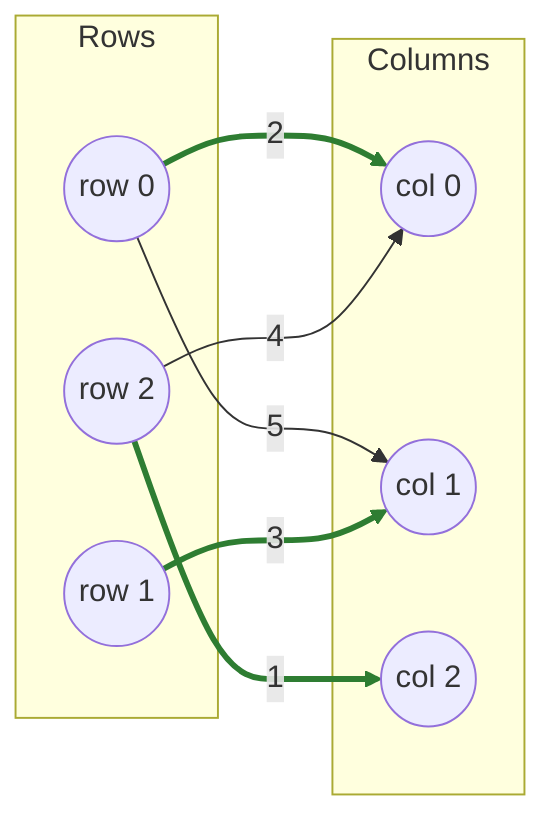

# LAPMOD

A **sparse-adjacency shortest-augmenting-path solver**. One of two algorithms in fastlap with a true sparse fast path (the other being [LAPJVsp](lapjvsp.md), which layers LAPJV's column reduction on top of this same search).

!!! info "Prerequisites"
    [Augmenting Paths](concepts.md#augmenting-paths) in Key Concepts, and ideally [LAPJV](lapjv.md) first — LAPMOD is that same search adapted to run on missing edges instead of a dense matrix.

## Why this approach

Every dense algorithm in fastlap accepts sparse input, but converts it to a dense `nrows × ncols` array first — fine for a small matrix, wasteful once it's mostly empty (as candidate-gated tracking or graph-matching problems often are). LAPMOD is built to operate directly on a row-adjacency list of explicit `(col, cost)` entries: missing `(row, col)` pairs are simply treated as infinitely costly, exactly as the rest of the crate treats them when densifying — LAPMOD just never pays for the dense allocation in the first place.

## How it works

The core mechanism is the same shortest-augmenting-path idea [LAPJV](lapjv.md) uses in its phase 3, adapted to run against an adjacency list instead of a dense matrix:

1. For each row (processed one at a time), run a Dijkstra-style search from that row, using a binary heap to always expand the currently-cheapest reachable column next.
2. **Only relax the row's real (explicit) edges.** A missing `(row, col)` pair is implicitly infinite cost, so it can never beat an existing finite distance — skipping it entirely is equivalent to relaxing it and losing.
3. When the search reaches a free column, the augmenting path is complete; flip it (reassign columns back along the path) exactly as the dense SAP solver does.
4. Track potentials (`u`, `v`) lazily with a running offset (`total_shift`) instead of rewriting every entry on every step, so a step's cost scales with the number of edges it actually touches, not the full column count.

This is what makes a single row cost `O(E_touched · log E_touched)` rather than `O(E_touched²)` — the difference matters once an augmenting/displacement chain has to walk through a large fraction of an already-matched sparse graph.

Rectangular sparse input needs somewhere to send a displaced match during augmentation, the same way [`pad_to_square`](../features/sparse.md) works for dense algorithms — but instead of densifying the whole matrix, LAPMOD adds a small number of explicit high-cost slack edges (`dim × |nrows − ncols|` of them), so the padding cost scales with the *rectangular imbalance*, not with `nrows × ncols`.

## Pseudocode

```text
function LAPMOD(adjacency, nrows, ncols):
    dim = max(nrows, ncols)
    add high-cost slack edges so every row can reach a virtual column, and
    (if rectangular) every virtual row can reach every real column

    u, v = 0, 0                      # potentials, lazily maintained
    for each row i in 0..dim:
        run a Dijkstra search from i over only the row's explicit edges:
            relax each explicit (col, cost) edge from the current frontier
            pop the cheapest not-yet-used column from a binary heap
            if that column is free: augmenting path complete, stop
            else: continue the search from the column's current occupant
        flip the augmenting path (reassign columns along it)
        update u, v for only the columns actually touched this round

    return assignment trimmed back to (nrows, ncols), unused virtual columns as None
```

## Complexity

| | Cost |
|---|---|
| **Time** | O(rows·nnz) for genuinely sparse input — dominated by however many edges each row's search actually touches; **O(n²log n)** in the worst case for dense input, since a binary-heap Dijkstra pays a log factor the plain-array dense SAP solver (used by LAPJV/Hungarian) does not |
| **Space** | O(n + nnz) for sparse input — the adjacency list plus O(n) potential/heap bookkeeping; **O(n²)** if the input is effectively dense (the adjacency list itself becomes O(n²)) |

## Worked example

A small sparse cost structure where most `(row, col)` pairs are forbidden (missing):

| | col 0 | col 1 | col 2 |
|---|---|---|---|
| **row 0** | 2 | 5 | ✗ |
| **row 1** | ✗ | 3 | ✗ |
| **row 2** | 4 | ✗ | 1 |

Row 1 can *only* reach column 1 — so row 1 → column 1 (cost 3) is forced. That leaves row 0 needing column 0 (its only remaining option, cost 2) and row 2 needing column 2 (its only remaining option, cost 1). There's exactly one feasible perfect matching: **row 0→0, row 1→1, row 2→2**, cost `2 + 3 + 1 = 6`.



Notice there's no edge at all for row 0–col 2, row 1–col 0, or row 1–col 2 — LAPMOD's search never even considers those pairs, because they simply don't exist in the adjacency list. A dense algorithm solving this same problem would first materialize all 9 cells (6 of them `+∞`) before starting.

Tracing the search: starting from row 0, the Dijkstra search relaxes only the two explicit edges (col 0 at cost 2, col 1 at cost 5) — column 2 is never even considered, because it's not in row 0's adjacency list. Column 0 (cheapest, and free) is reached first, so row 0 claims it immediately with no displacement needed. Row 1 and row 2 each have only one explicit edge, so their searches resolve in a single relaxation each.

```python
import scipy.sparse as sp
import fastlap

# Same structure as the table above; missing entries are implicitly forbidden.
csr = sp.csr_matrix(
    ([2, 5, 3, 4, 1], ([0, 0, 1, 2, 2], [0, 1, 1, 0, 2])),
    shape=(3, 3),
)
total, rows, cols = fastlap.solve_lap(csr, algorithm="lapmod")
print(total, rows)  # 6.0 [0, 1, 2]
```

## Common pitfalls

!!! danger "A missing entry means forbidden, not free"
    The single most common bug when hand-building a sparse cost matrix: treating an *absent* `(row, col)` pair as cost 0 (or leaving it as a default-initialized 0 in some intermediate array) instead of infinitely costly. Under LAPMOD's convention, "missing" means the edge doesn't exist at all — the algorithm will never even try it. If you accidentally construct a CSR matrix where "no data yet" silently reads back as `0.0` rather than being genuinely absent from `indices`/`data`, the solver will happily match on edges you never intended to offer, often producing a suspiciously *cheap* wrong answer rather than an obvious error.

Passing a `scipy.sparse.csr_matrix` to any algorithm name **other than** `"lapmod"` or `"lapjvsp"` still works, but densifies first — you get the same correct answer, just without the sparse fast path. It's an easy detail to miss: `algorithm="lapjv"` on sparse input doesn't error, doesn't warn, and doesn't skip densification; it just quietly pays the O(n²) memory cost. See [Sparse Matrices](../features/sparse.md).

## When to use it

Use `"lapmod"` whenever your cost matrix is genuinely sparse and you're passing a `scipy.sparse.csr_matrix` — candidate-gated multi-object tracking (only a handful of plausible track candidates per detection), large mostly-empty bipartite graphs. Want the same sparse solve but with LAPJV's column-reduction warm start to resolve most rows for free? Reach for [LAPJVsp](lapjvsp.md) instead — same convention, same answers, different preprocessing. See [Sparse Matrices](../features/sparse.md) for the full feature writeup. If your input is dense, use [LAPJV](lapjv.md).

## References

- R. Jonker & A. Volgenant, *"A Shortest Augmenting Path Algorithm for Dense and Sparse Linear Assignment Problems"*, Computing, 1987 (the "MOD" in LAPMOD refers to this paper's sparse-matrix variant).
