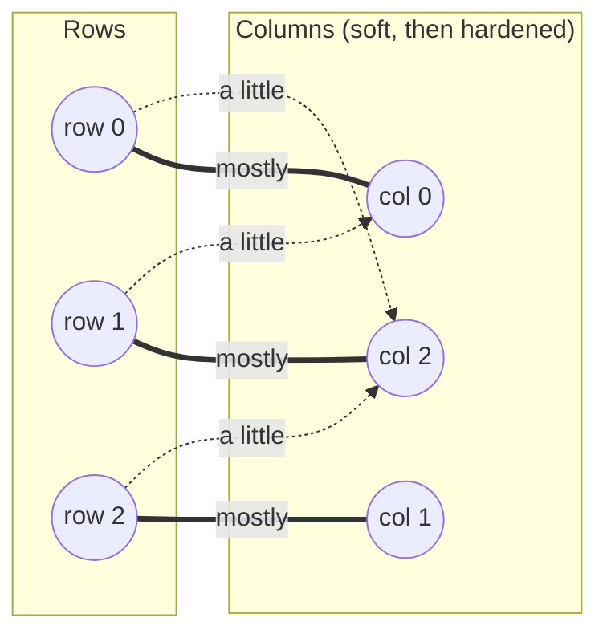

# Sinkhorn

**Entropic regularized optimal transport** (Sinkhorn–Knopp matrix scaling), followed by exact discrete recovery.

!!! info "Prerequisites"
    [Dual Variables & Reduced Cost](concepts.md#dual-variables-and-reduced-cost) and [Augmenting Paths](concepts.md#augmenting-paths) in Key Concepts. Some prior exposure to optimal transport (the idea of "moving mass" between distributions) helps but isn't required — the mechanics below are self-contained.

## Why this approach

The assignment problem is a special case of optimal transport where every source and every sink has exactly one unit of supply/demand. Optimal transport has its own celebrated iterative solver — Sinkhorn–Knopp scaling — which turns the (otherwise combinatorial) matching problem into repeated matrix-vector products on a smoothed, entropy-regularized version of the cost matrix. This is attractive if you're already working in an OT or differentiable-matching context (the regularized problem is differentiable in the cost matrix, unlike the discrete assignment problem), and fastlap uses it here purely as a way to compute good dual potentials cheaply — the final answer is still the *exact* discrete assignment, recovered in a second phase.

## How it works

1. **Build a Gibbs kernel.** `K[i][j] = exp(-(cost[i][j] - row_min[i]) / ε)` for a fixed regularization strength `ε` (chosen relative to the cost matrix's range, `ε = max(0.05 × range, 1e-4)`). Subtracting each row's minimum before exponentiating keeps the kernel numerically stable.
2. **Alternately rescale rows and columns.** Starting from uniform scaling vectors `a = b = 1/n`, repeat: `a[i] = 1 / (K @ b)[i]`, then `b[j] = 1 / (Kᵀ @ a)[j]`. After enough iterations, `diag(a) · K · diag(b)` converges toward a matrix whose rows and columns each sum to 1 — a "soft" permutation matrix.
3. **Convert scaling vectors to dual potentials.** `u[i] = ε · log(a[i])`, `v[j] = ε · log(b[j])`, clipped down where needed to guarantee `u[i] + v[j] ≤ cost[i][j]` (dual feasibility).
4. **Exact discrete recovery.** The soft assignment from step 2 is not itself a valid discrete matching, so fastlap runs the warm-started shortest-augmenting-path solver — the same mechanism [LAPJV](lapjv.md#how-it-works) uses — starting from these potentials, to recover the true optimal discrete assignment.

## Pseudocode

```text
function SINKHORN(cost, n):
    eps = max(0.05 * (max(cost) - min(cost)), 1e-4)
    K[i][j] = exp(-(cost[i][j] - row_min[i]) / eps)

    a, b = 1/n, 1/n
    repeat 100 times:
        a[i] = 1 / sum_j(K[i][j] * b[j])     for each i
        b[j] = 1 / sum_i(K[i][j] * a[i])     for each j

    u[i] = eps * log(a[i])
    v[j] = eps * log(b[j])
    clip u[i] down so u[i] + v[j] <= cost[i][j] for all j

    return SAP(cost, warm_start = (u, v))     # exact discrete recovery
```

## Complexity

| | Cost |
|---|---|
| **Time** | O(n²) per Sinkhorn iteration (two dense matrix-vector products), fixed at 100 iterations — O(100 n²); the exact-recovery SAP phase adds up to O(n³) worst case, so the overall bound is **O(n³)**, though the SAP phase is usually fast given a good warm start |
| **Space** | O(n²) — the Gibbs kernel matrix `K` and the padded cost matrix; scaling vectors and duals are O(n) |

## Worked example

fastlap's own test suite (`src/lap/sinkhorn.rs`) verifies this exact case:

$$
C = \begin{pmatrix} 1 & 2 & 3 \\ 2 & 4 & 1 \\ 3 & 1 & 2 \end{pmatrix}
$$

The regularization strength here is `ε = max(0.05 × (4 − 1), 1e-4) = 0.15`. After 100 scaling iterations, `a` and `b` converge close to the values that make `diag(a)·K·diag(b)` doubly-stochastic; the resulting duals `u, v` are close enough to optimal that the warm-started SAP phase resolves the exact discrete assignment in a handful of augmenting steps: **row 0→0, row 1→2, row 2→1**, cost `1 + 1 + 1 = 3` — matching the brute-force optimum (every other permutation costs strictly more).

Conceptually, the intermediate "soft" state that scaling converges toward looks like a fuzzy version of the final answer — every row spreads some probability mass across every reachable column, concentrated on the cheap ones:



The bold edges are where most of the mass concentrates as scaling converges (and exactly where the final discrete recovery lands); the dashed edges are residual "leakage" that the discrete SAP phase discards. This diagram is illustrative of the *shape* of convergence, not exact numeric weights from a hand-traced iteration.

```python
import fastlap

cost = [[1, 2, 3], [2, 4, 1], [3, 1, 2]]
total, rows, cols = fastlap.solve_lap(cost, algorithm="sinkhorn")
print(total, rows)  # 3.0 [0, 2, 1]
```

## Common pitfalls

!!! danger "Sinkhorn scaling alone does not solve the assignment problem"
    The single most common misconception for anyone coming from an OT background: the doubly-stochastic matrix Sinkhorn converges to is a **soft** assignment — every row's mass is spread (thinly) across every column, not concentrated on exactly one. It is *never* itself a valid discrete permutation, no matter how many iterations you run or how small you make `ε`. fastlap's discrete recovery phase (the warm-started SAP pass) isn't an optional cleanup step — it's the part that actually produces a valid assignment at all.

`ε` is a genuine numerical-stability tradeoff, not a free parameter. Too small, and `exp(-cost/ε)` underflows to 0 for anything but the very cheapest cells per row — the kernel becomes numerically degenerate and scaling stalls (fastlap guards this with a `kv > 1e-300` fallback, but the resulting duals are then less informative). Too large, and the smoothing dominates real cost differences, weakening the warm start and pushing more work onto the SAP phase. fastlap's `ε = max(0.05 × range, 1e-4)` is a reasonable default, not a universal constant.

## When to use it

Reach for `"sinkhorn"` if you're already working in an optimal-transport or differentiable-matching pipeline and want an assignment solver that shares the same numerical machinery (Gibbs kernels, entropic regularization) as the rest of that pipeline. For general-purpose exact solving, [LAPJV](lapjv.md) skips the 100-iteration scaling phase entirely and is faster.

## References

- M. Cuturi, *"Sinkhorn Distances: Lightspeed Computation of Optimal Transport"*, NeurIPS, 2013.
- R. Sinkhorn & P. Knopp, *"Concerning Nonnegative Matrices and Doubly Stochastic Matrices"*, Pacific Journal of Mathematics, 1967.
