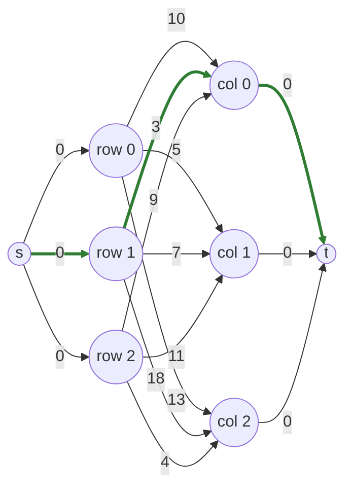

# SSP (Successive Shortest Path)

**Min-Cost Max-Flow** on the bipartite assignment network, with exact Johnson node potentials.

!!! info "Prerequisites"
    [Min-Cost Flow Framing](concepts.md#min-cost-flow-framing) in Key Concepts.

## Why this approach

The assignment problem is exactly a min-cost perfect matching, which is exactly a min-cost max-flow instance on a specific bipartite network — this is the most direct "assignment as flow" formulation in the whole crate. SSP builds that network explicitly (source → rows → columns → sink) and finds the optimum by repeatedly sending one unit of flow along the cheapest available augmenting path, `n` times, once per row.

## How it works

1. **Build the flow network.** A source `s`, one node per row, one node per column, and a sink `t`. Source-to-row and column-to-sink edges have cost 0 and capacity 1; row-to-column edges cost `cost[i][j]`. A matched row also gets a *reverse* edge back from its column at cost `-cost[i][j]`, letting a later augmenting path "undo" and reassign it if that's cheaper overall.
2. **Maintain Johnson potentials.** Raw edge costs can be negative (the reverse edges), which would normally force slower Bellman-Ford shortest paths. Johnson's trick avoids that: maintain a potential `π` per node such that every *reduced* cost `cost[u][v] + π[u] − π[v]` stays non-negative, so a plain Dijkstra can be used at every phase.
3. **One phase per row.** Run Dijkstra from the source to the sink using reduced costs; the shortest path corresponds to the cheapest way to extend the current matching by one more row (possibly by displacing and reassigning an already-matched row along the way, via the reverse edges). Augment one unit of flow along it, update the potentials by the shortest-path distances found, and repeat.
4. After `n` phases, every row is matched and the total flow cost equals the optimal assignment cost.

## Pseudocode

```text
function SSP(cost, n):
    build network: s -> rows (cost 0), rows -> cols (cost[i][j]),
                    cols -> s-sink reverse (cost -cost[i][j]) if matched,
                    cols -> t (cost 0) if unmatched

    pi = 0                                    # Johnson potentials
    for n phases:
        dist, path = Dijkstra(s -> t, using reduced costs cost + pi[u] - pi[v])
        pi[v] += min(dist[v], dist[t])  for every node v      # re-establish feasibility
        augment one unit of flow along `path`
        (a reversed edge in `path` un-matches and re-matches rows as needed)

    return the resulting matching, total flow cost
```

## Complexity

| | Cost |
|---|---|
| **Time** | O(n³ log n) — `n` phases, each a Dijkstra over O(n) nodes and O(n²) edges using a binary heap (`O(n² log n)` per phase); commonly rounded to **O(n³)** in comparisons that treat the heap's log factor as lower-order |
| **Space** | O(n²) — the dense cost matrix; the flow network itself only needs O(n) nodes, but potentials/distance/parent arrays and the cost matrix dominate |

## Worked example

fastlap's own test suite (`src/lap/ssp.rs`) verifies this exact case:

$$
C = \begin{pmatrix} 10 & 5 & 13 \\ 3 & 7 & 18 \\ 9 & 11 & 4 \end{pmatrix}
$$



**Phase 1** starts from all-zero potentials, so the reduced cost of any source→row→column→sink path is just `cost[i][j]` itself — the shortest path is simply the single cheapest cell in the whole matrix. That's `cost[1][0] = 3` (row 1, column 0), so phase 1 augments **row 1 → column 0** — the green path highlighted above.

**Phases 2–3** repeat the same reduced-cost Dijkstra, now with potentials updated to reflect phase 1's shortest-path distances and one column already spoken for; each phase finds the next-cheapest way to extend the matching (potentially reassigning row 1 via its reverse edge, if that turns out to be globally cheaper). The result — verified by the crate's test — is: **row 0→1, row 1→0, row 2→2**, cost `5 + 3 + 4 = 12`.

```python
import fastlap

cost = [[10, 5, 13], [3, 7, 18], [9, 11, 4]]
total, rows, cols = fastlap.solve_lap(cost, algorithm="ssp")
print(total, rows)  # 12.0 [1, 0, 2]
```

## Common pitfalls

!!! danger "Skipping the reverse edges turns this into a (wrong) greedy algorithm"
    The reverse edge from a matched column back to its row (at negative cost) is what lets a later, better phase "steal" a column from an earlier, worse assignment. Without it, SSP degenerates into: process rows one at a time, greedily grab the best still-free column, never reconsider — exactly [Greedy](greedy.md)'s no-lookahead flaw, just dressed up in flow-network language. The reverse edges are not an optimization; they're what makes the algorithm exact.

Potentials must be updated by the *shortest-path distance actually found*, not by some approximation — an off-by-one error here (updating before vs. after finding `dist[t]`, or using stale distances) silently breaks Johnson's non-negativity guarantee, which then breaks Dijkstra's correctness on the next phase without any obvious error at the point of failure.

## When to use it

`"ssp"` is the natural choice if you're already thinking about the problem as a min-cost flow instance, or building on top of a broader flow-based pipeline. For general-purpose exact solving, [LAPJV](lapjv.md) has a tighter time bound (no Dijkstra log factor) and is faster in practice.

## References

- The Successive Shortest Path algorithm for min-cost flow is standard graph-theory material; see e.g. Ahuja, Magnanti & Orlin, *"Network Flows: Theory, Algorithms, and Applications"*, 1993, Chapter 9.
