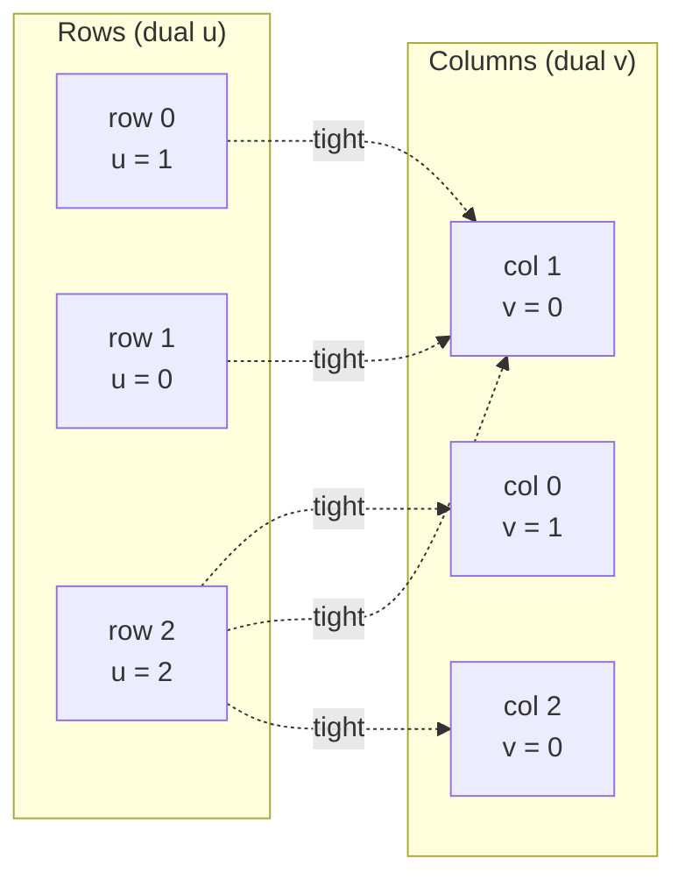

# Subgradient

**Coordinate-wise dual ascent**, used to warm-start the same O(n³) shortest-augmenting-path primal recovery that [LAPJV](lapjv.md) and [Sinkhorn](sinkhorn.md) also rely on.

!!! info "Prerequisites"
    [Dual Variables & Reduced Cost](concepts.md#dual-variables-and-reduced-cost) and [Augmenting Paths](concepts.md#augmenting-paths) in Key Concepts. This page assumes you've read [LAPJV](lapjv.md) first — its phase 3 *is* this algorithm's phase 2.

## Why this approach

The assignment problem's dual objective is concave and separable across `u[i]` and `v[j]`, which means each coordinate can be maximized **exactly** — no step-size tuning, no projection, unlike a generic subgradient method for a non-separable problem. This makes "subgradient ascent" here closer to true coordinate ascent: every round strictly improves (or holds) the dual objective, and every intermediate `(u, v)` pair is guaranteed feasible. The point isn't to solve the problem outright with duals alone (duals don't directly give a primal matching) — it's to build a genuinely good warm start for the augmenting-path solver cheaply, in O(n²) per round instead of paying the full O(n³) cold.

## How it works

1. **Dual ascent rounds.** Alternately set `u[i] = min_j(cost[i][j] − v[j])` for every row, then `v[j] = min_i(cost[i][j] − u[i])` for every column. Each assignment is an exact maximization along one coordinate of the dual LP — so `u, v` stay feasible (`u[i] + v[j] ≤ cost[i][j]` for all `i, j`) after every single round, for any real-valued cost matrix, with no non-negativity requirement.
2. **Warm-started primal recovery.** Run the shortest-augmenting-path solver starting from these near-optimal duals instead of the zero vector — the same mechanism [LAPJV](lapjv.md#how-it-works) uses in its phase 3. Because SAP always converges to the true optimum regardless of the feasible starting point, correctness never depends on how good the warm start is — only speed does.

## Pseudocode

```text
function SUBGRADIENT(cost, n):
    u, v = 0, 0
    repeat 8 times:
        for i in 0..n: u[i] = min_j (cost[i][j] - v[j])
        for j in 0..n: v[j] = min_i (cost[i][j] - u[i])

    return SAP(cost, warm_start = (u, v))     # same augmenting-path solver LAPJV uses
```

## Complexity

| | Cost |
|---|---|
| **Time** | O(n²) for the fixed 8 rounds of dual ascent (each round is two O(n²) passes), dominated by the O(n³) worst case of the SAP recovery phase — **O(n³) overall**, same asymptotic class as LAPJV, but typically converges in far fewer per-row augmenting searches thanks to the warm start |
| **Space** | O(n²) — the cost matrix; `u`, `v` are O(n) |

## Worked example

Same matrix as [LAPJV](lapjv.md#worked-example):

$$
C = \begin{pmatrix} 4 & 1 & 3 \\ 2 & 0 & 5 \\ 3 & 2 & 2 \end{pmatrix}
$$

**Round 1**, starting from `u = v = [0, 0, 0]`:

- `u[i] = min_j cost[i][j]`: `u = [1, 0, 2]` (row minima).
- `v[j] = min_i (cost[i][j] − u[i])`: `v[0] = min(4−1, 2−0, 3−2) = 1`, `v[1] = min(1−1, 0−0, 2−2) = 0`, `v[2] = min(3−1, 5−0, 2−2) = 0`. So `v = [1, 0, 0]`.

**Round 2** recomputes `u` and `v` from these values and gets exactly the same numbers back — the duals have already reached a fixed point after a single round: `u = [1, 0, 2]`, `v = [1, 0, 0]`.

Checking feasibility (`u[i] + v[j] ≤ cost[i][j]`), several cells are *tight* (equality): `(0,1)`, `(1,1)`, `(2,0)`, `(2,1)`, `(2,2)`. That's not quite a full tight matching yet — row 0 and row 1 both only have column 1 as a tight option — so the warm-started SAP phase still has to run and resolve the conflict via one augmenting step, using exactly the mechanism traced in detail on the [LAPJV page](lapjv.md#worked-example). It converges to the same optimum: **row 0→1, row 1→0, row 2→2**, cost `1 + 2 + 2 = 5`.



Every dashed edge above has reduced cost exactly 0 — but row 0 and row 1 collide on column 1, which is exactly why a tight *dual pair* isn't automatically a tight *perfect matching*: the SAP phase has to pick which of them actually gets column 1, and displace the other onto its own tight (or nearly-tight) alternative.

```python
import fastlap

cost = [[4, 1, 3], [2, 0, 5], [3, 2, 2]]
total, rows, cols = fastlap.solve_lap(cost, algorithm="subgradient")
print(total, rows)  # 5.0 [1, 0, 2]
```

## Common pitfalls

!!! warning "Tight duals are not a matching"
    It's tempting to think that once `u, v` are feasible and every row/column has *some* tight edge, you're done. You're not: complementary slackness requires a **perfect** matching using only tight edges, and as the worked example shows, two rows can easily be tight against the *same* column while everything else is under-determined. The dual ascent phase never resolves that conflict on its own — it only ever hands off a good starting point to the SAP phase, which is where the actual matching decision gets made.

The fixed 8 rounds of dual ascent are not adaptive — on a pathological matrix, 8 rounds might land further from the fixed point than this example's single round did, in which case the warm start is weaker and the SAP phase does more work. This never threatens correctness (SAP is exact regardless of starting duals), only speed.

## When to use it

A reasonable pick when you want an exact solver but expect the dual structure to be informative — e.g. if you're already thinking about the problem in dual terms, or comparing warm-start strategies. For general-purpose use, [LAPJV](lapjv.md)'s column-reduction warm start is cheaper to compute per round and just as exact.

## References

- M. Held & R. M. Karp, *"The Traveling-Salesman Problem and Minimum Spanning Trees: Part II"*, Mathematical Programming, 1971 (the paper that popularized dual/subgradient warm-starting for combinatorial optimization problems, including assignment).
